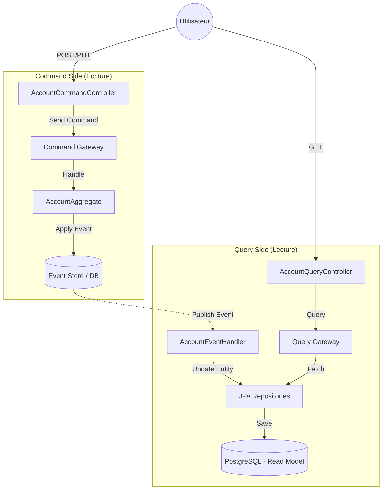
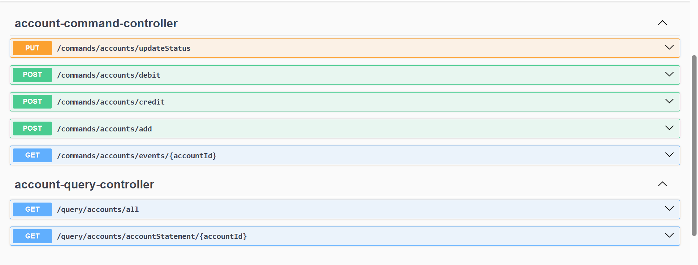
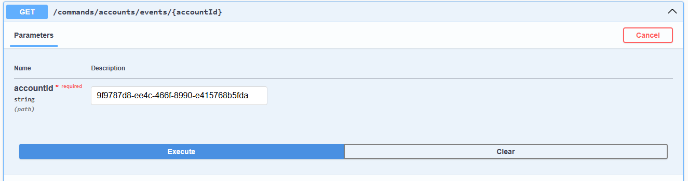
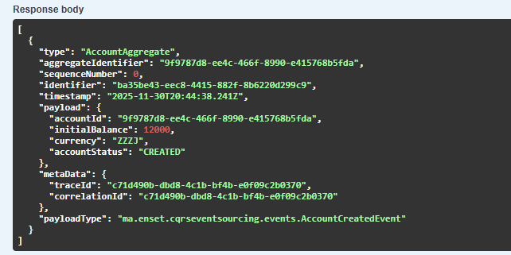

# Rapport de TP : Architecture CQRS et Event Sourcing avec Spring Boot & Axon

## 1\. Contexte et Objectifs

Ce projet illustre la mise en œuvre d'une architecture distribuée basée sur les patterns **CQRS** (Command Query Responsibility Segregation) et **Event Sourcing** appliquée au domaine bancaire.

L'objectif est de séparer distinctement la partie écriture (Commandes) de la partie lecture (Requêtes) pour optimiser la scalabilité et la traçabilité. L'état des comptes bancaires n'est pas stocké tel quel, mais dérivé d'une séquence d'événements immuables rejoués pour reconstruire l'état courant.

## 2\. Architecture Technique

Le système est construit autour du framework **Axon** qui facilite la gestion des bus de commandes, des bus d'événements et des bus de requêtes.

### Diagramme d'Architecture Logique



### Stack Technologique

  * **Langage & Framework** : Java 21, Spring Boot 3.4.12.
  * **CQRS & Event Sourcing** : Axon Framework 4.12.2 (Mode Server Connector exclu pour utiliser JPA Event Store).
  * **Base de Données** : PostgreSQL 16 (via Docker) pour stocker à la fois l'Event Store et les projections de lecture (Tables `Account` et `AccountOperation`).
  * **Documentation API** : SpringDoc OpenApi (Swagger UI).
  * **Conteneurisation** : Docker Compose (Postgres + PgAdmin).

## 3\. Implémentation Fonctionnelle

### A. Command Side (Logique métier)

C'est le cœur du système où les règles métier sont validées. L'agrégat `AccountAggregate` gère les commandes suivantes :

1.  **`AddAccountCommand`** : Création du compte. Vérifie que le solde initial est positif. Génère les événements `AccountCreatedEvent` et `AccountActivatedEvent`.
2.  **`CreditAccountCommand`** : Crédite le compte. Vérifie que le compte est `ACTIVATED` et le montant positif. Génère `AccountCreditedEvent`.
3.  **`DebitAccountCommand`** : Débite le compte. Vérifie le solde suffisant (Règle métier). Génère `AccountDebitedEvent`.
4.  **`UpdateAccountStatusCommand`** : Change l'état (ex: ACTIVATED -\> SUSPENDED).

### B. Query Side (Projections)

Cette partie écoute les événements pour mettre à jour une base de données optimisée pour la lecture.

  * **`AccountEventHandler`** : Souscrit aux événements et met à jour les entités JPA `Account` et `AccountOperation`.
  * **Modèles de lecture** :
      * `Account` : ID, solde actuel, statut, devise.
      * `AccountOperation` : Historique des transactions (Type, Montant, Date).

## 4\. API Rest Exposée

L'application expose deux contrôleurs distincts conformément au pattern CQRS.

### Command API (`AccountCommandController`)

| Méthode | Endpoint | Description |
| :--- | :--- | :--- |
| `POST` | `/commands/accounts/add` | Ouvre un nouveau compte bancaire. |
| `POST` | `/commands/accounts/credit` | Effectue un dépôt d'argent. |
| `POST` | `/commands/accounts/debit` | Effectue un retrait d'argent. |
| `PUT` | `/commands/accounts/updateStatus` | Modifie le statut du compte. |
| `GET` | `/commands/accounts/events/{id}` | **Event Sourcing** : Récupère le flux d'événements bruts pour un compte donné. |

### Query API (`AccountQueryController`)

| Méthode | Endpoint | Description |
| :--- | :--- | :--- |
| `GET` | `/query/accounts/all` | Liste l'état actuel de tous les comptes. |
| `GET` | `/query/accounts/accountStatement/{id}` | Retourne le relevé de compte complet (Infos compte + Liste opérations). |

## 5\. Démonstration et Captures d'écran

### 5.1 Documentation Swagger UI

Vue d'ensemble de tous les endpoints disponibles, séparés clairement entre les contrôleurs de Commandes et de Requêtes.  


### 5.2 Event Sourcing en Action (Lecture de l'Event Store)

Formulaire Swagger pour lire les événements d'un agrégat via `/commands/accounts/events/{accountId}`.  


### 5.3 Détail d'un Événement (Payload)

Exemple de la structure JSON d'un événement `AccountCreatedEvent`. On y voit :

  * Le **payload** : données métier (balance initiale 12000, devise ZZZJ, statut CREATED).
  * Les **métadonnées** : `aggregateIdentifier`, `sequenceNumber`, timestamp, etc.  


## 6\. Guide de Démarrage

### Prérequis

  * Java 21
  * Docker & Docker Compose

### Lancement

1.  **Démarrer l'infrastructure (Base de données)** :

    ```bash
    docker-compose up -d
    ```

    *Ceci lance PostgreSQL sur le port 5432 et pgAdmin sur le port 8088.*

2.  **Lancer l'application Spring Boot** :

    ```bash
    ./mvnw spring-boot:run
    ```

    *L'application sera accessible sur le port 8066.*

3.  **Accéder à l'interface** :

      * Swagger UI : `http://localhost:8066/swagger-ui/index.html`
      * PgAdmin : `http://localhost:8088` (Email: `root@gmail.com`, Pass: `root`)
